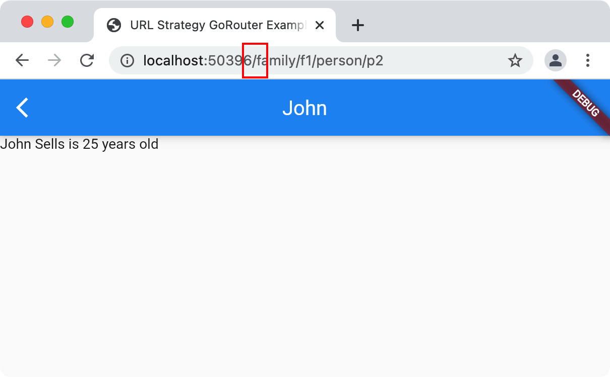

# TODO
- rewrite tests
- move GoRouter._builder to GoRouterDelegate to hid GRD.pop method
- merge GoRouter and GoRouterDelegate?
- update README (including removing this TODO)
- publish

# go_router
The goal of the [go_router package](https://pub.dev/packages/go_router) is to
simplify use of [the `Router` in
Flutter](https://api.flutter.dev/flutter/widgets/Router-class.html) as specified
by [the `MaterialApp.router`
constructor](https://api.flutter.dev/flutter/material/MaterialApp/MaterialApp.router.html).
By default, it requires an implementation of the
[`RouterDelegate`](https://api.flutter.dev/flutter/widgets/RouterDelegate-class.html)
and
[`RouteInformationParser`](https://api.flutter.dev/flutter/widgets/RouteInformationParser-class.html)
classes. These two implementations themselves imply the definition of a custom
type to hold the app state that drives the creation of the
[`Navigator`](https://api.flutter.dev/flutter/widgets/Navigator-class.html). You
can read [an excellent blog post on these requirements on
Medium](https://medium.com/flutter/learning-flutters-new-navigation-and-routing-system-7c9068155ade).
This separation of responsibilities allows the Flutter developer to implement a
number of routing and navigation policies at the cost of
[complexity](https://www.reddit.com/r/FlutterDev/comments/koxx4w/why_navigator_20_sucks/).

The purpose of the go_router is to use declarative routes to reduce complexity,
regardless of the platform you're targeting, handling deep linking from Android,
iOS, the web, etc. while still allowing an easy-to-use developer experience.

# Getting Started
To use the go_router package, [follow these
instructions](https://pub.dev/packages/go_router/install).

# Declarative Routing
The go_router is governed by a set of routes which you specify via a routes
builder function:

```dart
class App extends StatelessWidget {
  ...
  late final _router = GoRouter(routes: _routesBuilder, error: _errorBuilder);
  List<GoRoute> _routesBuilder(BuildContext context, String location) => [
    GoRoute(
      path: '/',
      builder: (context, state) => const MaterialPage<HomePage>(
        key: state.pageKey,
        child: Page1Page(),
      ),
    ),
    GoRoute(
      path: '/page2',
      builder: (context, state) => const MaterialPage<Page2Page>(
        key: state.pageKey,
        child: Page2Page(),
      ),
    ),
  ];
  ...
}
```

In this case, we've defined two routes. These route `path` will be matched
against the location. Only a single path will be matched, specifically the
one that matches the entire location (and so it doesn't matter in which order
you list your routes). A `GoRoute` also contains a page `builder` function which
is called to create the page when a path is matched.

The builder function is passed a `state` object which contains some useful
information like the current location that's being matched, parameter values for
[parametized routes](#parameters) and the one used in this example code is the
`pageKey` property of the state object. The `pageKey` is used to create a unique
key for the `MaterialPage` or `CupertinoPage` based on the current path for
that page in the [stack of pages](#sub-routes), so it will uniquely identify the
page w/o having to hardcode a key or come up with one yourself.

In addition, the go_router needs an `error` handler in case no page is found or
if any of the page builder functions throws an exception, e.g.

```dart
class App extends StatelessWidget {
  ...
  late final _router = GoRouter(routes: _routesBuilder, error: _errorBuilder);
  ...
  Page<dynamic> _errorBuilder(BuildContext context, GoRouterState state) =>
      MaterialPage<ErrorPage>(
        key: state.pageKey,
        child: ErrorPage(state.error),
      );
}
```

The `GoRouterState` object contains the location that caused the exception and
the `Exception` that was thrown attempting to navigate to that route.

With these two functions in hand, you can establish your app's custom routing
policy using the `MaterialApp.router` constructor:

```dart
class App extends StatelessWidget {
  App({Key? key}) : super(key: key);

  @override
  Widget build(BuildContext context) => MaterialApp.router(
        routeInformationParser: _router.routeInformationParser,
        routerDelegate: _router.routerDelegate,
      );

  late final _router = GoRouter(routes: _routesBuilder, error: _errorBuilder);
  List<GoRoute> _routesBuilder(BuildContext context, String location) => ...
  Page<dynamic> _errorBuilder(BuildContext context, GoRouterState state) => ...
}
```

With the router in place, your app can now navigate between pages.

# Navigation
To navigate between pages, use the `GoRouter.go` method:

```dart
// navigate using the GoRouter
onTap: () => GoRouter.of(context).go('/page2')
```

The go_router also provides a simplified version using Dart extension methods:

```dart
// more easily navigate using the GoRouter
onTap: () => context.go('/page2')
```

The simplified version maps directly to the more fully-specified version, so you
can use either. If you're curious, the ability to just call `context.go(...)`
and have the right thing happen is where the name of the go_router came from.

# Initial Location
If you'd like to set an initial location for routing, you can:

```dart
late final _router = GoRouter(
  routes: _routesBuilder,
  error: _errorBuilder,
  initialLocation: '/page2',
);
```

This location will only be used if the initial location would otherwise be `/`.
If your app is started using [deep linking](#deep-linking), the initial location
will be ignored.

# Parameters
The route paths are defined and
implemented in the [`path_to_regexp`](https://pub.dev/packages/path_to_regexp)
package, which gives you the ability to include parameters in your route: 

```dart
List<GoRoute> _routesBuilder(BuildContext context, String location) => [
  GoRoute(
    path: '/family/:fid',
    builder: (context, state) {
      final family = Families.family(state.params['fid']!);

      return MaterialPage<FamilyPage>(
        key: state.pageKey,
        child: FamilyPage(family: family),
      );
    },
  ),
];
```

The page builder function can use the parameters parsed from the path to do
things like look up data to use to initialize each page. If you'd like to be
more restrictive about the parameters, you can use regular expressions, e.g.
`/family/:fid(f\d+)`.

# Sub-routes
Every top-level route will create a navigation stack of one page. To produce an
entire stack of pages, you can use sub-routes. In the case that a top-level
route only matches part of the location, the rest of the location can be matched
against sub-routes. The rules are still the same, i.e. that only a single
route at any level will be matched and the entire location much be matched.

For example, the location `/family/f1/person/p2`, can be made to match multiple
sub-routes to create a stack of pages:

```
/         => HomePage()
family/f1 => FamilyPage('f1')
person/p2 => PersonPage('p2') ← showing this page, Back pops the stack ↑
```
To specify a set of pages like this, you can use sub-page routing via the
`routes` parameter to the `GoRoute` constructor:

```dart
List<GoRoute> _routesBuilder(BuildContext context, String location) => [
  GoRoute(
    path: '/',
    builder: (context, state) => MaterialPage<HomePage>(
      key: state.pageKey,
      child: HomePage(families: Families.data),
    ),
    routes: [
      GoRoute(
        path: 'family/:fid',
        builder: (context, state) {
          final family = Families.family(state.params['fid']!);

          return MaterialPage<FamilyPage>(
            key: state.pageKey,
            child: FamilyPage(family: family),
          );
        },
        routes: [
          GoRoute(
            path: 'person/:pid',
            builder: (context, state) {
              final family = Families.family(state.params['fid']!);
              final person = family.person(state.params['pid']!);

              return MaterialPage<PersonPage>(
                key: state.pageKey,
                child: PersonPage(family: family, person: person),
              );
            },
          ),
        ],
      ),
    ],
  ),
];
```

The go_router will match the routes all the way down the tree of sub-routes to
build up a stack of pages. If go_router doesn't find a match, then the error
handler will be called.

Also, the go_router will pass parameters from higher level sub-routes so that
they can be used in lower level routes, e.g. `fid` is matched as part of the
`family/:fid` route, but it's passed along to the `person/:pid` route because
it's a sub-route of the `family/:fid` route.

# Guards for redirection
Sometimes you want to guard pages from being accessed when they shouldn't be,
e.g. when the user is not yet logged in. To do this, initialize the `GoRouter`
with a guard object using the `guard` parameter of the ctor:

```dart
class App extends StatelessWidget {
  final loginInfo = LoginInfo();
  App({Key? key}) : super(key: key);

  // add the login info into the tree as app state that can change over time
  @override
  Widget build(BuildContext context) => ChangeNotifierProvider<LoginInfo>.value(
        value: loginInfo,
        child: MaterialApp.router(
          routeInformationParser: _router.routeInformationParser,
          routerDelegate: _router.routerDelegate,
          title: 'Redirection GoRouter Example',
          debugShowCheckedModeBanner: false,
        ),
      );

  late final _router = GoRouter(
    routes: _routesBuilder,
    error: _errorBuilder,

    // the guard checks if the user is logged in
    guard: Guard(loginInfo),
  );

  List<GoRoute> _routesBuilder(BuildContext context, String location) => ...
  Page<dynamic> _errorBuilder(BuildContext context, GoRouterState state) => ...
}

class Guard extends GoRouterGuard {...}
```

Your guard class must extend the `GoRouterGuard` class and override the
`redirect` method:

```dart
class Guard extends GoRouterGuard {
  // passing loginInfo to the base class will cause a change to trigger routing
  Guard(LoginInfo loginInfo) : super(loginInfo);

  LoginInfo get loginInfo => super.listenable! as LoginInfo;

  // redirect based on app and routing state
  @override
  String? redirect(String location) {
    final loggedIn = loginInfo.loggedIn;
    final goingToLogin = location == '/login';

    // the user is not logged in and not headed to /login, they need to login
    if (!loggedIn && !goingToLogin) return '/login';

    // the user is logged in and headed to /login, no need to login again
    if (loggedIn && goingToLogin) return '/';

    // no need to redirect at all
    return null;
  }
}
```

In this code, if the user is not logged in and not going to the `/login`
path, we redirect to `/login`. Likewise, if the user *is* logged in but going
`/login`, we redirect to `/`.

Notice that the login info is passed to the
`super` constructor of the base guard class. This is so that when the login info
changes, i.e. the user logs in, the route will be refreshed. Notice also that
the the custom guard class uses the base class's `listenable` property to get to
the login info, avoiding the need to cache the same data twice.

In this example, the workflow works like this:

1. the user navigates to `/` but is not logged in, so is redirected to `/login`
1. the user logs in, which changes the login info, which causes go_router to
   refresh the route
1. the router calls the guard's `redirect` method with the location where the
   app is currently navigated to: `/login`
1. the user is now logged in, so the guard redirects the user to `/`

This login path is common enough that go_router has built in support for it
via the `GoRouterLoginGuard` class. Start by creating your login info class with
the `GoRouterLoggedIn` mixin:

```dart
class LoginInfo extends ChangeNotifier with GoRouterLoggedIn {
  var _userName = '';
  String get userName => _userName;

  void login(String userName) {
    _userName = userName;
    notifyListeners();
  }

  void logout(String userName) {
    _userName = '';
    notifyListeners();
  }

  // override the GoRouterLoggedIn.loggedIn property
  @override
  bool get loggedIn => _userName.isNotEmpty;
}
```

The `loggedIn` property is used by the `GoRouterLoginGuard` class  to determine
the user's logged in state. With this in hand, you can simply use the
`GoLoginGuard` class instead of implementing your own custom guard:

```dart
// implements GoRouterLoggedIn
final loginInfo = LoginInfo();

late final _router = GoRouter(
  routes: _routesBuilder,
  error: _errorBuilder,

  // the guard checks if the user is logged in via the GoRouterLoggedIn mixin
  guard: GoRouterLoginGuard(loginInfo, loginPath: '/login'),
);
```

By default, if the user is logged in and headed to the login path, they will be
redirected to `/`. If you'd like to override this behavior, you can pass the
`homePath` parameter to the `GoRouterLoginGuard` ctor.

# Query Parameters
Sometimes you're doing [deep linking](#deep-linking) and
you'd like a user to first login before going to the location that represents
the deep link. In that case, you can use query parameters in the guard:

```dart
class Guard extends GoRouterGuard {
  ...

  // redirect based on app and routing state
  @override
  String? redirect(String location) {
    // watching LoginInfo will cause a change in LoginInfo to trigger routing
    final loggedIn = loginInfo.loggedIn;
    final loc = Uri.parse(location).path;
    final goingToLogin = loc == '/login';

    // the user is not logged in and not headed to /login, they need to login
    // also, keep track of the deep link that was used to get here
    if (!loggedIn && !goingToLogin) return '/login?from=$loc';

    // the user is logged in and headed to /login, no need to login again
    if (loggedIn && goingToLogin) return '/';

    // no need to redirect at all
    return null;
  }
}
```

In this example, if the user isn't logged in, they're redirected to `/login`
with a `from` query parameter set to the deep link. Now, when the
`/login` route is matched, we want to pull the `from` parameter out of the
`state` object to pass along to the `LoginPage`:

```dart
GoRoute(
  path: '/login',
  builder: (context, state) => MaterialPage<LoginPage>(
    key: state.pageKey,

    // pass the deep link to the LoginPage (if there is one)
    child: LoginPage(from: state.args['from']),
  ),
),
```

In the `LoginPage`, if the `from` parameter was passed, we use it to go to the
deep link location after a successful login:

```dart
class LoginPage extends StatelessWidget {
  final String? from;
  const LoginPage({this.from, Key? key}) : super(key: key);

  @override
  Widget build(BuildContext context) => Scaffold(
        appBar: AppBar(title: Text(_title(context))),
        body: Center(
          child: Column(
            mainAxisAlignment: MainAxisAlignment.center,
            children: [
              ElevatedButton(
                  // log a user in, letting all the listeners know
                  context.read<LoginInfo>().login('user1');

                  // if there's a deep link, go there
                  if (from != null) context.go(from!);
                },
                child: const Text('Login'),
              ),
            ],
          ),
        ),
      );
}
```

The `GoRouterLoginGuard` class also has a `fromParam` property that you can use
to simplify your routing in this case, too:

```dart
// implements GoRouterLoggedIn
final loginInfo = LoginInfo();

late final _router = GoRouter(
  routes: _routesBuilder,
  error: _errorBuilder,

  // the guard checks if the user is logged in via the GoRouterLoggedIn mixin,
  // passing in the original location as a query parameter
  guard: GoRouterLoginGuard(
    loginInfo,
    loginPath: '/login',
    fromParam: 'from',
  ),
);
```

The `GoRouterLoginGuard` doesn't assume you want to pass along the original
location so that it doesn't step on a query parameter with a default name you
don't set and are therefore not aware of.

# Deep Linking
Flutter defines "deep linking" as "opening a URL displays that screen in your
app." Anything that's listed as a `GoRoute` can be accessed via deep linking
across Android, iOS and the web. Support works out of the box for the web, of
course, via the address bar, but requires additional configuration for Android
and iOS as described in the [Flutter
docs](https://flutter.dev/docs/development/ui/navigation/deep-linking).

To make deep links more svelte for your users, you may decide to change
Flutter's default [URL path strategy](#url-path-strategy).

# URL Path Strategy
By default, Flutter adds a hash (#) into the URL for web apps:


The process for turning off the hash is
[documented](https://flutter.dev/docs/development/ui/navigation/url-strategies)
but fiddly. The go_router has built-in support for setting the URL path
strategy, however, so you can simply call `GoRouter.setUrlPathStrategy` before
calling `runApp` and make your choice:

```dart
void main() {
  // turn on the # in the URLs on the web (default)
  // GoRouter.setUrlPathStrategy(UrlPathStrategy.hash);

  // turn off the # in the URLs on the web
  GoRouter.setUrlPathStrategy(UrlPathStrategy.path);

  runApp(App());
}
```

Setting the path instead of the hash strategy turns off the # in the URLs:



If your router is created as part of the construction of the widget passed to
the `runApp` method, you can use a shortcut to set the URL path strategy by
using the `urlPathStrategy` parameter of the `GoRouter` ctor:

```dart
 // no need to call GoRouter.setUrlPathStrategy() here
 void main() => runApp(App());

/// sample app using the path URL strategy, i.e. no # in the URL path
class App extends StatelessWidget {
  late final _router = GoRouter(
    routes: _routesBuilder,
    error: _errorBuilder,
    // turn off the # in the URLs on the web
    urlPathStrategy: UrlPathStrategy.path,
  );
  ...
}
```

Finally, when you deploy your Flutter web app to a web server, it needs to be
configured such that every URL ends up at your Flutter web app's `index.html`,
otherwise Flutter won't be able to route to your pages. If you're using Firebase
hosting, you can [configure
rewrites](https://firebase.google.com/docs/hosting/full-config#rewrites) to
cause all URLs to be rewritten to `index.html`.

If you'd like to test your release build locally before publishing, and get that
cool redirect to `index.html` feature, you can use `flutter run` itself:

```sh
$ flutter run -d chrome --release lib/url_strategy.dart
```

Note that you have to run this command from a place where `flutter run` can find
the `web/index.html` file.

Of course, any local web server that can be configured to redirect all traffic
to `index.html` will do, e.g.
[live-server](https://www.npmjs.com/package/live-server).

# Custom Builder
As described, the go_router uses the list of `GoRoute` objects to implement it's
routing policy using paths to match and using the order of matches to create
the `Navigator.pop()` implementation, etc. If you'd like to implement the
routing policy yourself, you can implement a widget builder that is given a
location and is responsible for producing a `Navigator`. For example, this
builder can be implemented and passed to the `GoRouter.builder` constructor like
so:

```dart
class App extends StatelessWidget {
  ...
  late final _router = GoRouter.builder(builder: _builder);
  Widget _builder(BuildContext context, String location) {
    final locPages = <String, Page<dynamic>>{};

    try {
      final segments = Uri.parse(location).pathSegments;

      // home page, i.e. '/'
      {
        const loc = '/';
        final page = MaterialPage<HomePage>(
          key: const ValueKey('HomePage'),
          child: HomePage(families: Families.data),
        );
        locPages[loc] = page;
      }

      // family page, e.g. '/family/:fid
      if (segments.length >= 2 && segments[0] == 'family') {
        final fid = segments[1];
        final family = Families.family(fid);

        final loc = '/family/$fid';
        final page = MaterialPage<FamilyPage>(
          key: ValueKey(family),
          child: FamilyPage(family: family),
        );

        locPages[loc] = page;
      }

      // person page, e.g. '/family/:fid/person/:pid
      if (segments.length >= 4 &&
          segments[0] == 'family' &&
          segments[2] == 'person') {
        final fid = segments[1];
        final pid = segments[3];
        final family = Families.family(fid);
        final person = family.person(pid);

        final loc = '/family/$fid/person/$pid';
        final page = MaterialPage<PersonPage>(
          key: ValueKey(person),
          child: PersonPage(family: family, person: person),
        );

        locPages[loc] = page;
      }

      // if we haven't found any matching routes OR if the last route doesn't
      // match exactly, then we haven't got a valid stack of pages; the latter
      // allows '/' to match as part of a stack of pages but to fail on
      // '/nonsense'
      if (locPages.isEmpty ||
          locPages.keys.last.toString().toLowerCase() !=
              location.toLowerCase()) {
        throw Exception('page not found: $location');
      }
    } on Exception catch (ex) {
      locPages.clear();

      final loc = location;
      final page = MaterialPage<ErrorPage>(
        key: const ValueKey('ErrorPage'),
        child: ErrorPage(message: ex.toString()),
      );

      locPages[loc] = page;
    }

    return Navigator(
      pages: locPages.values.toList(),
      onPopPage: (route, dynamic result) {
        if (!route.didPop(result)) return false;

        // remove the route for the page we're showing and go to the next
        // location up
        locPages.remove(locPages.keys.last);
        _router.go(locPages.keys.last);

        return true;
      },
    );
  }
}
```

There's a lot going on here, but it fundamentally boils down to 3 things:
1. Matching portions of the location to instances of the app's pages using
   manually parsed URI segments for arguments. This mapping is kept in an
   ordered map so it can be used as a stack of location=>page mappings.
1. Providing an implementation of `onPopPage` that will translate
   `Navigation.pop` to use the location=>page mappings to navigate to the
   previous page on the stack.
1. Show an error page if any of that fails.

This is the basic policy that the `GoRouter` itself implements, although in a
simplified form w/o features like route paths, redirection or query
parameters.

# Examples
You can see the go_router in action via the following examples:
- [`main.dart`](example/lib/main.dart): define a basic routing policy using a
  set of declarative `GoRoute` objects
- [`init_loc.dart`](example/lib/init_loc.dart): start at a specific location
  instead of home (`/`), which is the default
- [`sub_routes.dart`](example/lib/sub_routes.dart): provide a stack of pages
  based on a set of sub routes
- [`redirection.dart`](example/lib/redirection.dart): redirect one route to
  another based on changing app state
- [`query_params.dart`](example/lib/query_params.dart): optional query
  parameters will be passed to all page builders
- [`url_strategy.dart`](example/lib/url_strategy.dart): turn off the # in the
  Flutter web URL
- [`builder.dart`](example/lib/builder.dart): define routing policy by providing
  a custom builder

You can run these examples from the command line like so (from the `example`
folder):

```sh
$ flutter run lib/main.dart
```

Or, if you're using Visual Studio Code, a [`launch.json`](.vscode/launch.json)
file has been provided with these examples configured.

# Issues
Do you have an issue with or feature request for go_router? Log it on the [issue
tracker](https://github.com/csells/go_router/issues).

# Design Notes/Open Questions
- Redirect depends on go or push wrt what page(s) it replaces
- What does refresh mean? How does it work with login state change?
- Restoration state is list of URLs
  - first is deep link: stack of pages
  - rest are top links: just one new page
  - should the parsing into params etc be the core state? Makes popping faster
- Is the router just a container for the parser and the delegate? Is all the
  work done in the delegate?
- Problem: Back button in app is push on browser
- Redirect: need a stack to track cycles
- Stack of pages:
  - Redirect is matching the stack of pages and checking for redirect on the top
    most page
  - Go is matching the stack of pages and building the entire stack
  - Push is matching the stack of pages and adding the top most page to the go
    stack
  - Pop is cropping the top page off the stack of pages. Does that mean that go
    is just turning a stack of matches into a stack of pushes? And the state of
    the router is that stack of pushes?
- Sub routes are needed to translate /login into a one-page stack (no home page)
  and /settings into a two-page stack (include the home page).
- How does state restoration work wrt routing?
