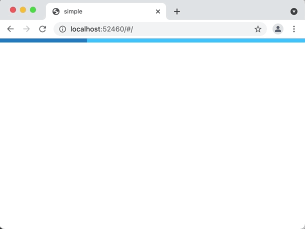

# Async Data

Sometimes you'll want to load data asynchronously. In that case, you'll want to
pass the params to the screen that's going to show the data and let it do the
lookup itself:

```dart
late final _router = GoRouter(
  routes: [
    GoRoute(
      path: '/',
      builder: (context, state) => const HomeScreenWithAsync(),
      routes: [
        GoRoute(
          path: 'family/:fid',
          builder: (context, state) => FamilyScreenWithAsync(
            fid: state.params['fid']!,
          ),
          routes: [
            GoRoute(
              path: 'person/:pid',
              builder: (context, state) => PersonScreenWithAsync(
                fid: state.params['fid']!,
                pid: state.params['pid']!,
              ),
            ),
          ],
        ),
      ],
    ),
  ],
);
```

The screen can use whatever it likes to do the lookup. For example, the
following shows the use of [the Repository
pattern](https://martinfowler.com/eaaCatalog/repository.html) and [the Flutter
`FutureBuilder`](https://api.flutter.dev/flutter/widgets/FutureBuilder-class.html)
to load and show the data:

```dart
class FamilyScreenWithAsync extends StatefulWidget {
  const FamilyScreenWithAsync({required this.fid, Key? key}) : super(key: key);
  final String fid;

  @override
  State<FamilyScreenWithAsync> createState() => _FamilyScreenWithAsyncState();
}

class _FamilyScreenWithAsyncState extends State<FamilyScreenWithAsync> {
  Future<Family>? _future;
  Family? _family;

  @override
  void initState() {
    super.initState();
    fetch();
  }

  @override
  void didUpdateWidget(covariant FamilyScreenWithAsync oldWidget) {
    super.didUpdateWidget(oldWidget);

    // refresh cached data
    if (oldWidget.fid != widget.fid) fetch();
  }

  void fetch() {
    _family = null;
    _future = App.repo.getFamily(widget.fid);
    _future!.then(
      (family) => setState(() => _family = family), // update AppBar
    );
  }

  @override
  Widget build(BuildContext context) => Scaffold(
        appBar: AppBar(title: Text(_family?.name ?? 'loading...')),
        body: FutureBuilder<Family>(
          future: _future,
          builder: (context, snapshot) {
            if (snapshot.connectionState == ConnectionState.waiting) {
              return const Center(child: CircularProgressIndicator());
            }

            if (snapshot.hasError) return SnapshotError(snapshot.error!);

            assert(snapshot.hasData);
            return ListView(
              children: [
                for (final p in _family!.people)
                  ListTile(
                    title: Text(p.name),
                    onTap: () =>
                        context.go('/family/${_family!.id}/person/${p.id}'),
                  ),
              ],
            );
          },
        ),
      );
}
```

This code shows a progress indicator as the data is being fetched and an error
in the case that the fetch fails. 



Take a look at the [async
example](https://github.com/csells/go_router/blob/master/example/lib/async_data.dart)
for the full details.