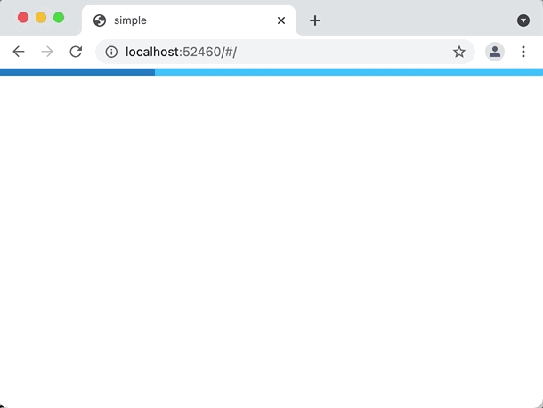

# 非同期データ

非同期に取得したデータを元に画面を生成したい場合は、パラメータを画面側に渡してその先でデータの取得を行います。

```dart
late final _router = GoRouter(
  routes: [
    GoRoute(
      path: '/',
      builder: (context, state) => const HomeScreenWithAsync(),
      routes: [
        GoRoute(
          path: 'family/:fid',
          builder: (context, state) => FamilyScreenWithAsync(
            fid: state.params['fid']!,
          ),
          routes: [
            GoRoute(
              path: 'person/:pid',
              builder: (context, state) => PersonScreenWithAsync(
                fid: state.params['fid']!,
                pid: state.params['pid']!,
              ),
            ),
          ],
        ),
      ],
    ),
  ],
);
```

データの取得はどのような方法でも構いません。
例えば、以下のサンプルコードは[リポジトリ・パターン](https://martinfowler.com/eaaCatalog/repository.html)と
[Flutter の FutureBuilder](https://api.flutter.dev/flutter/widgets/FutureBuilder-class.html) を使用してデータのロードと表示を行っています。

```dart
class FamilyScreen extends StatefulWidget {
  const FamilyScreen({required this.fid, Key? key}) : super(key: key);
  final String fid;

  @override
  State<FamilyScreen> createState() => _FamilyScreenState();
}

class _FamilyScreenState extends State<FamilyScreen> {
  Future<Family>? _future;

  @override
  void initState() {
    super.initState();
    _fetch();
  }

  @override
  void didUpdateWidget(covariant FamilyScreen oldWidget) {
    super.didUpdateWidget(oldWidget);

    // refresh cached data
    if (oldWidget.fid != widget.fid) _fetch();
  }

  void _fetch() => _future = App.repo.getFamily(widget.fid);

  @override
  Widget build(BuildContext context) => FutureBuilder<Family>(
        future: _future,
        builder: (context, snapshot) {
          if (snapshot.connectionState == ConnectionState.waiting) {
            return Scaffold(
              appBar: AppBar(title: const Text('Loading...')),
              body: const Center(child: CircularProgressIndicator()),
            );
          }

          if (snapshot.hasError) {
            return Scaffold(
              appBar: AppBar(title: const Text('Error')),
              body: SnapshotError(snapshot.error!),
            );
          }

          assert(snapshot.hasData);
          final family = snapshot.data!;
          return Scaffold(
            appBar: AppBar(title: Text(family.name)),
            body: ListView(
              children: [
                for (final p in family.people)
                  ListTile(
                    title: Text(p.name),
                    onTap: () => context.go(
                      '/family/${family.id}/person/${p.id}',
                    ),
                  ),
              ],
            ),
          );
        },
      );
}
```

データ取得中はロードインジケーターを表示し、取得が失敗した場合はエラー内容を表示します。



このサンプルコードのフルバージョンは[こちら](https://github.com/csells/go_router/blob/master/example/lib/async_data.dart)でご覧いただけます。
