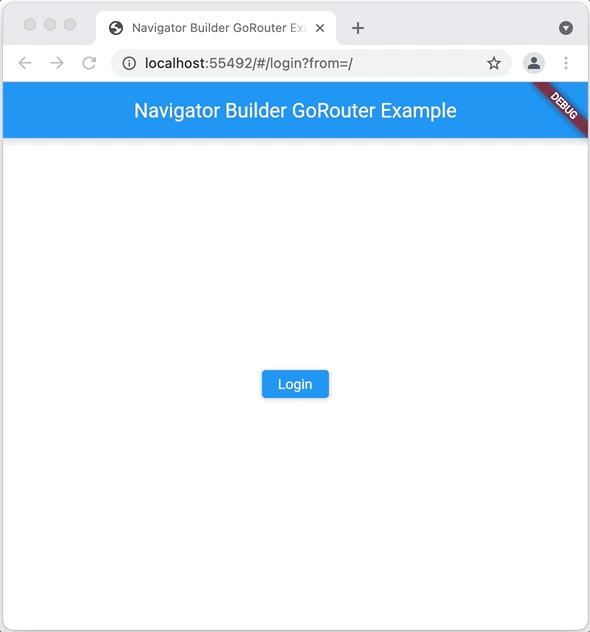

# Navigator ビルダー

`MaterialApp`/`CupertinoApp` と `Navigator` の間にウィジェットを置きたいと思ったことはないでしょうか。
例えば、context 経由で現在のロケールを取得する Provider を置いたり、
ナビゲーションの外側にUIを設けたり、あるいは `Navigator` を他の独自のものに置き換えたり（これについてはこのドキュメントの範囲外ですが）。

これらの目的を達成するには `GoRouter` コンストラクタの `navigatorBuilder` パラメータを使用する必要があります。
これは `MaterialApp` の `builder` パラメータに似ていますが、`MaterialApp` によって提供されるインフラストラクチャにアクセスすることができます。

以下は `navigatorBuilder` を使って Provider ウィジェットを置く例です。

```dart
final _router = GoRouter(
  routes: ...,

  // loginInfo をウィジェットツリーに挿入するために Navigator にラッパーを追加する
  navigatorBuilder: (context, child) => ChangeNotifierProvider<LoginInfo>.value(
    value: loginInfo,
    child: child,
    builder: (context, child) => child!,
  ),
);
```

また、こちらはより興味深い例です。全てのページにオーバーレイのボタンを表示し、簡単にログアウトできるようにしています。

```dart
final _router = GoRouter(
  routes: ...,

  // 次の2点の目的のために Navigator にラッパーを追加
  // - loginInfo をウィジェットツリーに挿入
  // - ログアウト用のオーバーレイを追加
  navigatorBuilder: (context, child) => ChangeNotifierProvider<LoginInfo>.value(
    value: loginInfo,
    child: child,
    builder: (context, child) => loginInfo.loggedIn
        ? AuthOverlay(onLogout: loginInfo.logout, child: child!)
        : child!,
  ),
);
```

この例では `navigatorBuilder` の中でログインステータスをチェックしています。

- ユーザーがログインしていれば、`AuthOverlay` ウィジェットのインスタンスが作成されます。
`navigatorBuilder` に `child` として渡される `Navigator` の上にこれを置き、全ページにログアウトボタンを表示します。
- ユーザーがログインしていない場合は、`child` パラメータからそのまま `Navigator` を返します。

`AuthOverlay` は `Stack` を使ってログアウトボタンと `Navigator` を表示しています。

```dart
class AuthOverlay extends StatelessWidget {
  const AuthOverlay({
    required this.onLogout,
    required this.child,
    Key? key,
  }) : super(key: key);

  final Widget child;
  final VoidCallback onLogout;

  @override
  Widget build(BuildContext context) => Stack(
        children: [
          child,
          Positioned(
            top: 90,
            right: 4,
            child: ElevatedButton(
              onPressed: onLogout,
              child: const Icon(Icons.logout),
            ),
          ),
        ],
      );
}
```

実際の動作はこのようになります。


