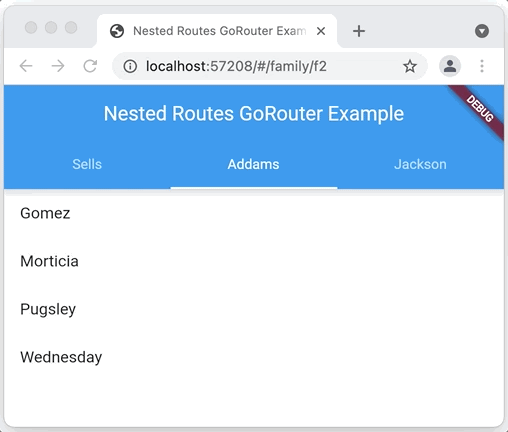
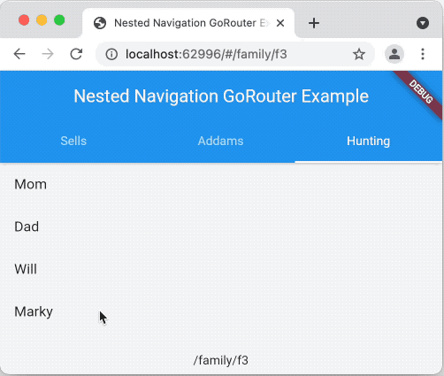

# ネスト（入れ子）型ナビゲーション

ルートのみならず、状態（現在選択されているタブなど）を元に表示する画面内容を決定したい場合があります。
このような場合はルートから画面を生成する際に、入れ子にしたいウィジェットを指定します。
これを「ネスト（入れ子）型ナビゲーション」と呼びます。
ネスト型ナビゲーションが通常のナビゲーションと異なる点は、入れ子の部分を包括するページの共通部分にはトランジション効果がないという点です。
例えば、以下の `TabBarView` では異なるタブに移動しても、アプリバーの見た目は変わりません。



もちろん、これは `TabBarView` ウィジェットを使うだけで簡単に実現できることですが、
これが「ネスト型ナビゲーション」と言える理由はロケーション名が変わるところにあります（タブからタブへ移動する際のアドレスバーに注目）。
これにより、ユーザーはアプリ内のオブジェクトに付与される動的リンクを簡単に取得することができ、ディープリンクが可能となります。

このネスト型ナビゲーションを go_router を使用して実現するには、単純に異なるパスから同じページを生成する方法の他に、
同じパスに異なるパラメータを与えて、それを元にページを生成する方法があります。
例えば、上記のような `TabBarView` 付きの画面を実装する場合は、渡されたパラメータの値に応じて選択タブが変わるウィジェットが必要です。

```dart
class FamilyTabsScreen extends StatefulWidget {
  final int index;
  FamilyTabsScreen({required Family currentFamily, Key? key})
      : index = Families.data.indexWhere((f) => f.id == currentFamily.id),
        super(key: key) {
    assert(index != -1);
  }

  @override
  _FamilyTabsScreenState createState() => _FamilyTabsScreenState();
}

class _FamilyTabsScreenState extends State<FamilyTabsScreen>
    with TickerProviderStateMixin {
  late final TabController _controller;

  @override
  void initState() {
    super.initState();
    _controller = TabController(
      length: Families.data.length,
      vsync: this,
      initialIndex: widget.index,
    );
  }

  @override
  void dispose() {
    _controller.dispose();
    super.dispose();
  }

  @override
  void didUpdateWidget(FamilyTabsScreen oldWidget) {
    super.didUpdateWidget(oldWidget);
    _controller.index = widget.index;
  }

  @override
  Widget build(BuildContext context) => Scaffold(
        appBar: AppBar(
          title: Text(_title(context)),
          bottom: TabBar(
            controller: _controller,
            tabs: [for (final f in Families.data) Tab(text: f.name)],
            onTap: (index) => _tap(context, index),
          ),
        ),
        body: TabBarView(
          controller: _controller,
          children: [for (final f in Families.data) FamilyView(family: f)],
        ),
      );

  void _tap(BuildContext context, int index) =>
      context.go('/family/${Families.data[index].id}');

  String _title(BuildContext context) =>
      (context as Element).findAncestorWidgetOfExactType<MaterialApp>()!.title;
}
```

`FamilyTabsScreen` は選択状態にしたい family をパラメータとして受け取る `StatefulWidget` です。
そして選択タブを設定するために、Families リストから取得した該当 family のインデックス値を使用します。
また、ユーザのクリックにより選択タブを直接切り替えることはせず、代わりにナビゲーション経由で次のタブのインデックス値を取得します。
アドレスバーが変わるのは、このようにナビゲーションを経由しているおかげです。
そしてタブのインデックス値は `didUpdateWidget` の呼び出し時に切り替えます。
`FamilyTabsScreen` は `StatefulWidget` なので、ウィジェット自体が更新されても状態は保持されます。
ウィジェットが更新された場合は `didUpdateWidget` が呼び出され、`TabController` のインデックス値が新たなロケーションに合わせて変更されます。

上記サンプルコードのナビゲーションサイドのコードには、パラメータ化されたパスを持ち、
そのパラメータ値を使用して `FamilyTabsScreen` を生成するようなルートが必要です。

```dart
final _router = GoRouter(
  routes: [
    GoRoute(
      path: '/',
      redirect: (_) => '/family/${Families.data[0].id}',
    ),
    GoRoute(
      path: '/family/:fid',
      builder: (context, state) {
        final fid = state.params['fid']!;
        final family = Families.data.firstWhere((f) => f.id == fid,
            orElse: () => throw Exception('family not found: $fid'));

        return FamilyTabsScreen(key: state.pageKey, currentFamily: family);
      },
    ),
  ],
);
```

`/` ルートに行くと、まず先頭の family のルートにリダイレクトされます。
`/family/:fid` ルートはまず `fid` パラメータにマッチする family を探し、
それを元に `FamilyTabsScreen` インスタンスを作成することでネスト型ナビゲーションを設定します。
次に `state.pageKey` を `FamilyTabsScreen` に渡すことで、
このページは前のインスタンスと同じページであることを Flutter に伝えています。
以上の動作によってルータは、ページをそのままにしながらブラウザのアドレスバーの内容を更新し、`TabBarView` を切り替えることができるわけです。

以上は盛りだくさんに見えてしまいますが、要するにネスト型ナビゲーションを導入するには、生成するページに以下2点の工夫が必要です。

1. 画面ウィジェットのベースとして `StatefulWidget` を使う。

2. ユーザーがタブを切り替える度に、同じ `StatefulWidget` のインスタンスが生成されることになります。
この際に同一のキーを使い回すことで、Flutter に状態を保持させたまま、ウィジェットのみを入れ替えることが可能です。
そしてこのウィジェットが配置されると `didUpdateWidget` が呼び出され、新しいデータを用いて既存の選択タブ等が更新されます。

ちなみにこのサンプルコードでは選択タブの変更を `TabBarView` に反映させていますが、どのようなネスト型コンテンツを用いても構いません。

## 状態をキープする

ネスト型ナビゲーションでは、ユーザーは別のページから戻ってきた際にウィジェットが同じ状態を保っていることを期待します。
例えば、スクロールポジションやテキスト入力の内容など。
これは `StatefulWidget` に `AutomaticKeepAliveClientMixin` を使用することで対応できます。
以下は[こちらのサンプルコード](https://github.com/csells/go_router/blob/main/go_router/example/lib/nested_nav.dart)からの一部抜粋です。

```dart
class FamilyView extends StatefulWidget {
  const FamilyView({required this.family, Key? key}) : super(key: key);
  final Family family;

  @override
  State<FamilyView> createState() => _FamilyViewState();
}

/// 状態を保持するには [AutomaticKeepAliveClientMixin] を使う。
class _FamilyViewState extends State<FamilyView>
    with AutomaticKeepAliveClientMixin {

  // `AutomaticKeepAliveClientMixin` を使う際は `wantKeepAlive` をオーバーライドする。
  @override
  bool get wantKeepAlive => true;

  @override
  Widget build(BuildContext context) {
    // `AutomaticKeepAliveClientMixin` を使う際は `super.build` を呼ぶ。
    super.build(context);
    return ListView(
      children: [
        for (final p in widget.family.people)
          ListTile(
            title: Text(p.name),
            onTap: () =>
                context.go('/family/${widget.family.id}/person/${p.id}'),
          ),
      ],
    );
  }
}
```

`AutomaticKeepAliveClientMixin` に状態をキープするよう伝えるには、
`wantKeepAlive` を override して `true` を返し、
`State` クラスの `build` メソッドの中で `super.build` を呼ぶ必要があります。



Hunting タブの長いリストの一番下までスクロールしてから別のタブに切り替えた後、
また Hunting タブに戻った際にスクロールポジションの状態がキープされていることが分かるかと思います。
