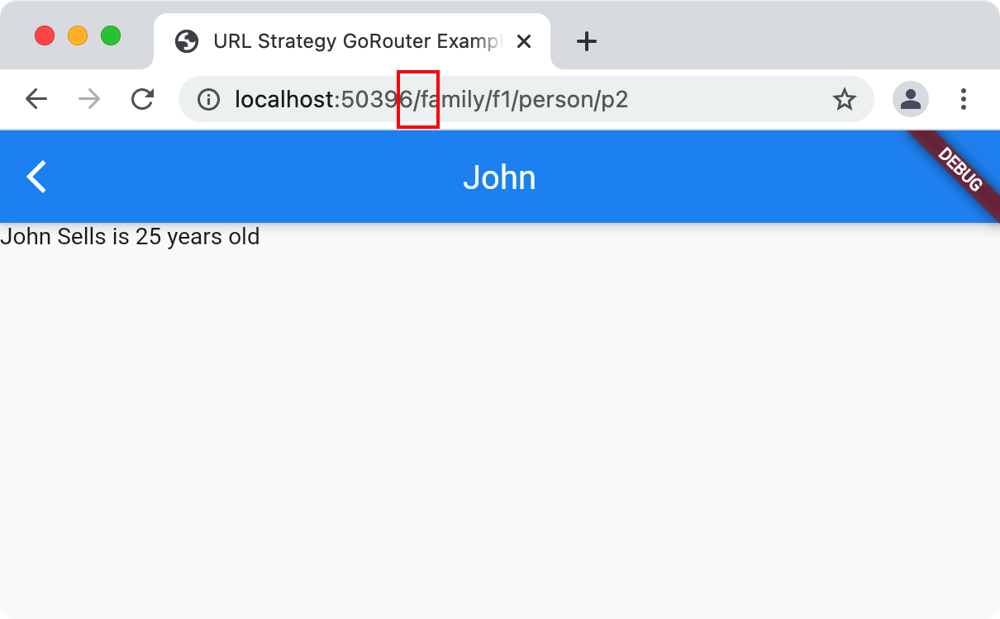

# URL パス・ストラテジー

Flutter ウェブの URL はデフォルトでハッシュ記号（#）を含みます。


## ハッシュ記号を除く

ハッシュ記号を除く方法は[公式ドキュメント](https://flutter.dev/docs/development/ui/navigation/url-strategies)に記載がありますが、少し手間がかかります。
go_router にはこの URL パス・ストラテジーの設定を行う機能が組み込まれています。

```dart
void main() {
  // URL に　# を含める（デフォルト）
  // GoRouter.setUrlPathStrategy(UrlPathStrategy.hash);

  // ウェブの URL　から # を除く
  GoRouter.setUrlPathStrategy(UrlPathStrategy.path);

  runApp(App());
}
```

`hash` の代わりに `path` ストラテジーを設定することで URL から # が除かれます。



`runApp` メソッドに渡すウィジェットによりルータが生成される場合は `GoRouter` コンストラクタの
`urlPathStrategy` パラメータを使用して URL パス・ストラテジーを設定することも可能です。

```dart
 // この時点で GoRouter.setUrlPathStrategy() を呼ぶ必要はありません
 void main() => runApp(App());

/// サンプルアプリでの URL パス・ストラテジーの設定
class App extends StatelessWidget {
  ...
  final _router = GoRouter(
    routes: ...,

    // ウェブの URL から # を除く
    urlPathStrategy: UrlPathStrategy.path,
  );
}
```

## ウェブサーバーの設定

最後に、Flutter ウェブアプリをウェブサーバーにデプロイするとき、全ての URL が Flutter ウェブアプリの `index.html` に紐づくよう設定が必要です。
設定しないと Flutter はページのルーティングができません。Firebase ホスティングを利用する場合は、
[rewrites を設定](https://firebase.google.com/docs/hosting/full-config#rewrites)することで URL が `index.html` に書き換わるようにできます。

公開前にリリースビルドをローカルでテストする際に `index.html` にリダイレクトする機能を試したい場合は、
以下のように `flutter run` を実行します。

```sh
$ flutter run -d chrome --release lib/url_strategy.dart
```

このコマンドは `flutter run` が `web/index.html` ファイルを探せる場所で実行する必要がある点に注意してください。

もちろん、全てのトラフィックを `index.html` にリダイレクトするよう設定できるローカルウェブサーバーがあればそれで事足ります。
（例: [live-server](https://www.npmjs.com/package/live-server)）