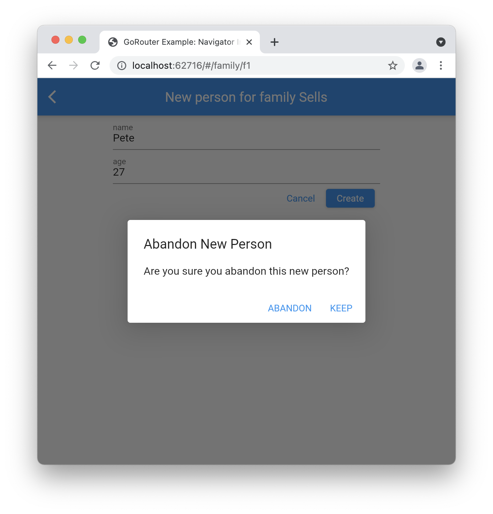

# ユーザー入力フォーム

ユーザーが入力した情報を収集する場合、フォーム付きの画面を作成して、入力データをアプリのデータストアに追加するのが常だと思います。
同じことが `Navigator` でも go_router でも実現できます。両方のパターンを見てみましょう。

## Navigator スタイル

`Navigator` の場合は次の通りです。スタックに入力情報を集めるための画面をプッシュしています。

```dart
...

IconButton(
  onPressed: () => _addPerson(context),
  tooltip: 'Add Person',
  icon: const Icon(Icons.add),
),

...

Future<void> _addPerson(BuildContext context) async {
  // ユーザー入力情報を収集
  final person = await Navigator.push<Person>(
    context,
    MaterialPageRoute(
      builder: (context) => NewPersonScreen(family: widget.family),
    ),
  );

  if (person != null) {
    // person をデータストアに追加
    setState(() => widget.family.people.add(person));

    // 新しい person の詳細ページに遷移
    context.goNamed('person', params: {
      'fid': widget.family.id,
      'pid': person.id,
    });
  }
}
```

ここでは `Navigator` を使用して新しい画面をプッシュし、入力情報の結果を受け取っています。
`GoRouter` を使用していませんが、期待通り動作します（ページスタックに新しいページを追加、`AppBar` に戻るボタンを追加等）。
結果のデータを受け取るには通常通り `Navigator.pop` を使います。

```dart
ButtonBar(children: [
  TextButton(
    onPressed: () => Navigator.pop(context),
    child: const Text('Cancel'),
  ),
  ElevatedButton(
    onPressed: () {
      if (_formKey.currentState!.validate()) {
        final person = Person(
          id: 'p${widget.family.people.length + 1}',
          name: _nameController.text,
          age: int.parse(_ageController.text),
        );

        Navigator.pop(context, person);
      }
    },
    child: const Text('Create'),
  ),
]),
```

上記のように `GoRouter` と `Navigator` を併用することは何も問題ありませんので、安心して使ってください。
ただ、`Navigator.push` をこのように使う限りはブラウザのアドレスバーは更新されないため、更新が必要な場合は
`GoRouter.go` もしくは `GoRouter.push` を使ってください。

## GoRouter スタイル

`GoRoute` に紐づくページを使用してユーザー入力情報を収集することも可能です。
ところが `go` も `push` も `Navigator` のようにいずれ返ってくる結果のデータを待ち受けることができません。
これは `GoRouter` がディープリンクと動的リンクの使用を前提に作られており、アプリ内のロケーションに関することは全てリンクで表現できるためです。
逆に言えば、`Navigator.push` でその場限りの画面を生成し、そこから結果が戻るのを待つというプロセスはリンクで表現できることではありません。

しかしこれは `GoRouter` を使用して `Navigator` と同じことができないということではありません。
実際、これは `GoRouter` が想定していたよくあるシナリオです。
画面の呼び出し元がユーザー入力情報の結果を利用できないのなら、呼び出された画面側が同様の処理を担当すればいいのです。

```dart
ButtonBar(children: [
  TextButton(
    onPressed: () {
      // Navigator.pop(context) でも可能
      context.pop();
    },
    child: const Text('Cancel'),
  ),
  ElevatedButton(
    onPressed: () {
      if (_formKey.currentState!.validate()) {
        final person = Person(
          id: 'p${widget.family.people.length + 1}',
          name: _nameController.text,
          age: int.parse(_ageController.text),
        );

        // データストアに person を追加
        widget.family.people.add(person);

        // 新しい person の詳細画面へ遷移
        context.goNamed('person', params: {
          'fid': widget.family.id,
          'pid': person.id,
        });
      }
    },
    child: const Text('Create'),
  ),
]),
```

この新規追加画面をサブルートとして設定します。

```dart
GoRoute(
  name: 'home',
  path: '/',
  builder: ...,
  routes: [
    GoRoute(
      name: 'family',
      path: 'family/:fid',
      builder: ...,
      routes: [
        GoRoute(
          name: 'person',
          path: 'person/:pid',
          builder: ...,
        ),
        GoRoute(
          name: 'new-person',
          path: 'new-person',
          builder: (context, state) {
            final family = Families.family(state.params['fid']!);
            return NewPersonScreen(family: family);
          },
        ),
      ],
    ),
  ],
),
```

呼び出し元の `_addPerson` メソッドは以下の通りです。

```dart
void _addPerson(BuildContext context) {
  context.goNamed('new-person', params: {'fid': widget.family.id});
}
```

このような場面で `GoRouter` を使用するメリットはディープリンクが機能することです（新規入力画面をリンクで表現できる）。
また画面自体がユーザー入力情報を処理することになるため、ユーザーが OK ボタンを押した瞬間に新しいユーザーの詳細ページに遷移することができます。
これは `Navigator` スタイルであればチラリと見えてしまう呼び出し元の画面が表示されないということです。

## ポップをキャンセルする

フォーム付き画面でユーザー入力情報を収集する場合、キャンセルボタンを押すことで入力情報が失われることがあります。
これはユーザーに事前に警告しておきたいことです。例えば...

```dart
TextButton(
  onPressed: () async {
    // データを破棄しても良いかユーザーに確認
    if (await abandonNewPerson(context)) context.pop();
  },
  child: const Text('Cancel'),
),

...

Future<bool> abandonNewPerson(BuildContext context) async {
  final result = await showOkCancelAlertDialog(
    context: context,
    title: 'Abandon New Person',
    message: 'Are you sure you abandon this new person?',
    okLabel: 'Keep',
    cancelLabel: 'Abandon',
  );

  return result == OkCancelResult.cancel;
}
```

この例ではユーザーがキャンセルボタンを押すと、入力データを破棄しても良いかを確認するダイアログが表示されます。
破棄しても良いとなった場合は、データは保存されず画面がポップします。
このダイアログはユーザーがアプリバーの戻るボタンを押したときに表示させても便利です。
戻るボタンを押したときの動作は `WillPopScope` ウィジェットで実装することができます。

```dart
class _NewPersonScreenState extends State<NewPersonScreen> {
  @override
  Widget build(BuildContext context) => WillPopScope(
        // データを破棄しても良いかユーザーに確認
        onWillPop: () async => abandonNewPerson(context),
        child: Scaffold(...),
  );
  ...
}
```

また `onWillPop` で `false` を返すことで画面のポップを打ち消すことができます。
このテクニックはその画面が `Navigator` によって追加されたものであれ、`GoRoute` に追加されたものであれ有効です。



ただし、これはユーザーがブラウザの戻るボタンを押した場合には対処できず、その場合は入力したデータは失われてしまいます。
そして残念なことに Flutter の Router API はこのためのフックが用意されていません。
ただ「ルータネグレクト」機能を使用することで、ブラウザの戻るボタンによる遷移を無効にすることはできます。
詳しくは[ウェブ履歴](/web-history)のセクションをご覧ください。