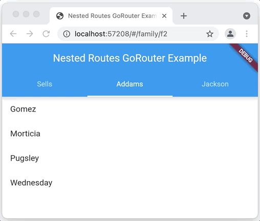
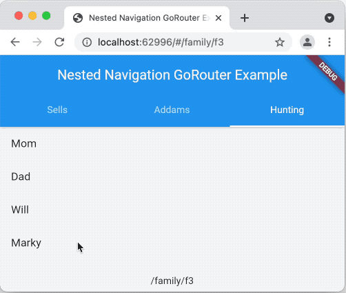

# Nested Navigation

Sometimes you want to choose a page based on a route as well as the state of
that screen, e.g. the currently selected tab. In that case, you want to choose
not just the screen from a route but also the widgets nested inside the screen.
That's called "nested navigation". The key differentiator for "nested"
navigation is that there's no transition on the part of the page that stays the
same, e.g. the app bar stays the same as you navigate to different tabs on this
`TabView`:



Of course, you can easily do this using the `TabView` widget, but what makes
this nested "navigation" is that the location changes, i.e. notice the address
bar as the user transitions from tab to tab. This makes it easy for the user to
capture a [dynamic link](/parameters/#dynamic-linking) for any object in the
app, enabling [deep linking](/declarative-routing#deep-linking).

To use nested navigation using go_router, you can simply navigate to the same
page via different paths or to the same path with different parameters, with the
differences dictating the different state of the page. For example, to implement
that screen with the `TabView` above, you need a widget that changes the
selected tab via a parameter:

```dart
class FamilyTabsScreen extends StatefulWidget {
  final int index;
  FamilyTabsScreen({required Family currentFamily, Key? key})
      : index = Families.data.indexWhere((f) => f.id == currentFamily.id),
        super(key: key) {
    assert(index != -1);
  }

  @override
  _FamilyTabsScreenState createState() => _FamilyTabsScreenState();
}

class _FamilyTabsScreenState extends State<FamilyTabsScreen>
    with TickerProviderStateMixin {
  late final TabController _controller;

  @override
  void initState() {
    super.initState();
    _controller = TabController(
      length: Families.data.length,
      vsync: this,
      initialIndex: widget.index,
    );
  }

  @override
  void dispose() {
    _controller.dispose();
    super.dispose();
  }

  @override
  void didUpdateWidget(FamilyTabsScreen oldWidget) {
    super.didUpdateWidget(oldWidget);
    _controller.index = widget.index;
  }

  @override
  Widget build(BuildContext context) => Scaffold(
        appBar: AppBar(
          title: Text(_title(context)),
          bottom: TabBar(
            controller: _controller,
            tabs: [for (final f in Families.data) Tab(text: f.name)],
            onTap: (index) => _tap(context, index),
          ),
        ),
        body: TabBarView(
          controller: _controller,
          children: [for (final f in Families.data) FamilyView(family: f)],
        ),
      );

  void _tap(BuildContext context, int index) =>
      context.go('/family/${Families.data[index].id}');

  String _title(BuildContext context) =>
      (context as Element).findAncestorWidgetOfExactType<MaterialApp>()!.title;
}
```

The `FamilyTabsScreen` is a stateful widget that takes the currently selected
family as a parameter. It uses the index of that family in the list of families
to set the currently selected tab. However, instead of switching the currently
selected tab to whatever the user clicks on, it uses navigation to get to that
index instead. It's the use of navigation that changes the address in the
address bar. And, the way that the tab index is switched is via the call to
`didUpdateWidget`. Because the `FamilyTabsScreen` is a stateful widget, the
widget itself can be changed but the state is kept. When that happens, the call
to `didUpdateWidget` will change the index of the `TabController` to match the
new navigation location.

To implement the navigation part of this example, we need a route that
translates the location into an instance of `FamilyTabsScreen` parameterized
with the currently selected family:

```dart
final _router = GoRouter(
  routes: [
    GoRoute(
      path: '/',
      redirect: (_) => '/family/${Families.data[0].id}',
    ),
    GoRoute(
      path: '/family/:fid',
      builder: (context, state) {
        final fid = state.params['fid']!;
        final family = Families.data.firstWhere((f) => f.id == fid,
            orElse: () => throw Exception('family not found: $fid'));

        return FamilyTabsScreen(key: state.pageKey, currentFamily: family);
      },
    ),
  ],
);
```

The `/` route is a redirect to the first family. The `/family/:fid` route is the
one that sets up nested navigation. It does this by first creating an
instance of `FamilyTabsScreen` with the family that matches the `fid` parameter.
And second, it uses `state.pageKey` to signal to Flutter that this is the same
page as before. This combination is what causes the router to leave the page
alone, to update the browser's address bar and to let the `TabView` navigate to
the new selection.

This may seem like a lot, but in summary, you need to do two things with the
page you create in your page builder to support nested navigation:

1. Use a `StatefulWidget` as the base class of your screen widget.

1. As the user navigates, you'll create the same `StatefulWidget`-derived type,
   passing in new data, e.g. which tab is currently selected. Because you're
   using a widget with the same key, Flutter will keep the state but swap out
   the widget wrapping w/ the new data as constructor args. When that new widget
   wrapper is in place, Flutter will call `didUpdateWidget` so that you can use
   the new data to update the existing widgets, e.g. the selected tab.

This example shows off the selected tab on a `TabView` but you can use it for
any nested content of a page your app navigates to.

## Keeping State

When doing nested navigation, the user expects that widgets will be in the same
state that they left them in when they navigated to a new page and return, e.g.
scroll position, text input values, etc. You can enable support for this by
using `AutomaticKeepAliveClientMixin` on a stateful widget. You can see this in
action in the `FamiliyView` of the
[`nested_nav.dart`](https://github.com/csells/go_router/blob/master/example/lib/nested_nav.dart)
example:

```dart
class FamilyView extends StatefulWidget {
  const FamilyView({required this.family, Key? key}) : super(key: key);
  final Family family;

  @override
  State<FamilyView> createState() => _FamilyViewState();
}

/// Use the [AutomaticKeepAliveClientMixin] to keep the state.
class _FamilyViewState extends State<FamilyView>
    with AutomaticKeepAliveClientMixin {

  // Override `wantKeepAlive` when using `AutomaticKeepAliveClientMixin`.
  @override
  bool get wantKeepAlive => true;

  @override
  Widget build(BuildContext context) {
    // Call `super.build` when using `AutomaticKeepAliveClientMixin`.
    super.build(context);
    return ListView(
      children: [
        for (final p in widget.family.people)
          ListTile(
            title: Text(p.name),
            onTap: () =>
                context.go('/family/${widget.family.id}/person/${p.id}'),
          ),
      ],
    );
  }
}
```

To instruct the `AutomaticKeepAliveClientMixin` to keep the state, you need to
override `wantKeepAlive` to return `true` and call `super.build` in the `State`
class's `build` method, as show above.



Notice that after scrolling to the bottom of the long list of children in the
Hunting family, then going to another tab and then going to another page, when
you return to the list of Huntings that the scroll position is maintained.
