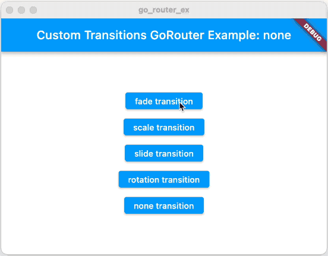

# Transitions

go_router comes with built in support for both default page transitions and
custom transitions.

## Default transitions

By default, go_router will use the page transition appropriate for the type of
the app in your widget tree, i.e. if you have `MaterialApp` in your widget tree,
then the default transition will defined by the `MaterialPage`. This will be
accomplished with a default page builder function defined in go_router that
looks like this:

```dart
MaterialPage<void> pageBuilderForMaterialApp(
  LocalKey key,
  String restorationId,
  Widget child,
) =>
    MaterialPage<void>(
      key: key,
      restorationId: restorationId,
      child: child,
    );
```

The `child` parameter is provided by the output of the route's `build` function,
which is how your app's screens get the appropriate transition between pages
without you needing to write this code for each route.

All of this is true for `CupertinoApp` and `CupertinoPage` as well.

If neither `MaterialApp` nor `CupertinoApp` is in your widget tree, then the
default transition will be no transition.

## pageBuilder instead of builder

If you'd like to provide your own `pageBuilder` function, you can do so on a
per-route basis:

```dart
GoRoute(
  path: '/page2',
  pageBuilder: (context, state) => MaterialPage<void>(
    key: state.pageKey,
    restorationId: state.pageKey.value,
    child: const Page2Screen(),
  ),
),
```

This functionally is equivalent to what go_router provides by default. The
`state.pageKey` property is based on the current path for that page in the
[stack of pages](/sub-routes), so it will uniquely identify the page w/o having
to hardcode a key or come up with one yourself, making it useful for populating
both the page's `key` and `restorationId` properties. You can set the `child`
property to whatever you would've otherwise returned from the `builder`
function.

## errorPageBuilder instead of errorBuilder

In the same way that you can provide a `pageBuilder` instead of a `builder` if
you'd like to have full control of the page that's being created, you can use
the `errorPageBuilder` instead of the `errorBuilder`:

```dart
class App extends StatelessWidget {
  ...
  final _router = GoRouter(
    ...
    errorPageBuilder: (context, state) => MaterialPage<void>(
      key: state.pageKey,
      child: ErrorScreen(state.error),
    ),
  );
}
```

## Custom transitions

One useful reason to implement `pageBuilder` instead of `builder` (or
`errorPageBuilder` instead of `errorBuilder`) is to provide a custom transition
between pages instead of what comes out of the box. You can do so by using the
`CustomTransitionPage` provided with go_router:

```dart
GoRoute(
  path: '/fade',
  pageBuilder: (context, state) => CustomTransitionPage<void>(
    key: state.pageKey,
    child: const TransitionsPage(kind: 'fade', color: Colors.red),
    transitionsBuilder: (context, animation, secondaryAnimation, child) =>
        FadeTransition(opacity: animation, child: child),
  ),
),
```

The `transitionBuilder` argument to the `CustomTransitionPage` is called when
you're routing to a new route, and it's your chance to return a transition
widget. The [transitions
sample](https://github.com/csells/go_router/blob/master/example/lib/transitions.dart)
shows off four different kind of transitions, but really you can do whatever you
want.



The `CustomTransitionPage` constructor also takes a `transitionsDuration`
argument in case you'd like to customize the duration of the transition as well
(it defaults to 300ms).

If you'd like your custom transition to be no transition at all, you can use the
`NoTransitionPage` also provided with go_router:

```dart
GoRoute(
  path: '/none',
  pageBuilder: (context, state) => NoTransitionPage<void>(
    key: state.pageKey,
    child: const ExampleTransitionsScreen(
      kind: 'none',
      color: Colors.white,
    ),
  ),
),
```

## Keys and stateful widgets

If you find yourself implementing a `pageBuilder` function that returns a screen
widget that extends `StatefulWidget`, you'll want to be careful with your keys.
For example, in [the books
sample](https://github.com/csells/go_router/blob/master/example/lib/books/main.dart),
multiple routes navigate to the same screen:

```dart
class Bookstore extends StatelessWidget {
  final _scaffoldKey = const ValueKey<String>('App scaffold'); // shared key

  late final _router = GoRouter(
    routes: [
      ...
      GoRoute(
        path: '/authors',
        pageBuilder: (context, state) => FadeTransitionPage(
          key: _scaffoldKey, // shared key
          child: const BookstoreScaffold(
            selectedTab: ScaffoldTab.authors,
            child: AuthorsScreen(),
          ),
        ),
        ...
      ),
      GoRoute(
        path: '/settings',
        pageBuilder: (context, state) => FadeTransitionPage(
          key: _scaffoldKey, // shared key
          child: const BookstoreScaffold(
            selectedTab: ScaffoldTab.settings,
            child: SettingsScreen(),
          ),
        ),
      ),
    ],
    ...
  );
  ...
}
```

Notice that, in addition to using a custom transition page (the
`FadeTransitionPage` extends `CustomTransitionPage`), the `/authors` and
`/settings` routes both use the same key. This is important because the
`BookstoreScaffold` screen is stateful and switches between tabs based on the
`selectedTab` property. If the keys were different, the user would see a jarring
transition as they switched between tabs. We can avoid this by using the same
key for different routes going to the same page.

You can learn more about the magic of keys in Flutter here:

<YouTube id="kn0EOS-ZiIc" />
