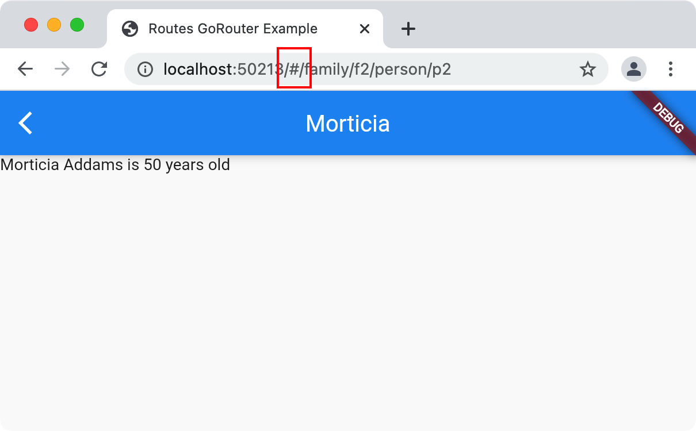
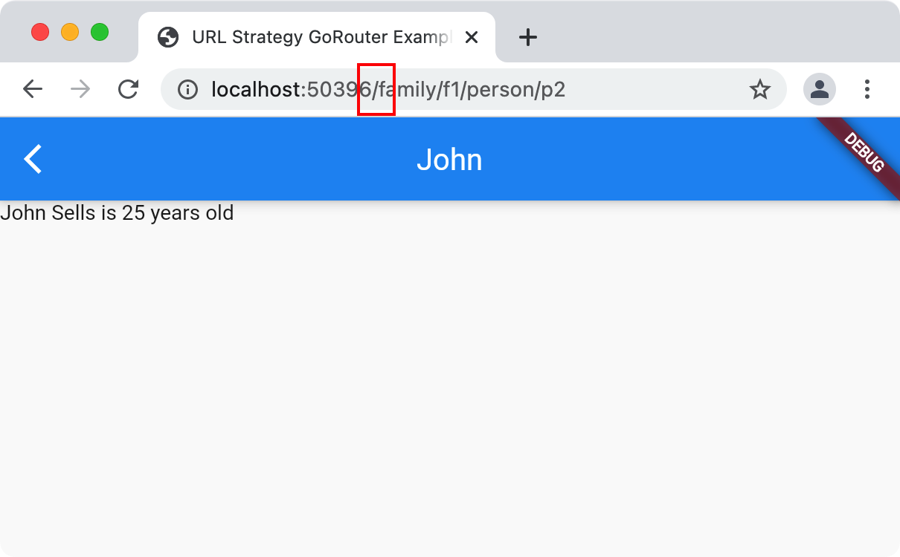

# URL Path Strategy

By default, Flutter adds a hash (#) into the URL for web apps:



## Turning Off the Hash

The process for turning off the hash is
[documented](https://flutter.dev/docs/development/ui/navigation/url-strategies)
but fiddly. go_router has built-in support for setting the URL path strategy,
however, so you can simply call `GoRouter.setUrlPathStrategy` before calling
`runApp` and make your choice:

```dart
void main() {
  // turn on the # in the URLs on the web (default)
  // GoRouter.setUrlPathStrategy(UrlPathStrategy.hash);

  // turn off the # in the URLs on the web
  GoRouter.setUrlPathStrategy(UrlPathStrategy.path);

  runApp(App());
}
```

Setting the path instead of the hash strategy turns off the # in the URLs:



If your router is created as part of the construction of the widget passed to
the `runApp` method, you can use a shortcut to set the URL path strategy by
using the `urlPathStrategy` parameter of the `GoRouter` constructor:

```dart
 // no need to call GoRouter.setUrlPathStrategy() here
 void main() => runApp(App());

/// sample app using the path URL strategy, i.e. no # in the URL path
class App extends StatelessWidget {
  ...
  final _router = GoRouter(
    routes: ...,

    // turn off the # in the URLs on the web
    urlPathStrategy: UrlPathStrategy.path,
  );
}
```

## Configuring the Web Server

Finally, when you deploy your Flutter web app to a web server, it needs to be
configured such that every URL ends up at your Flutter web app's `index.html`,
otherwise Flutter won't be able to route to your pages. If you're using Firebase
hosting, you can [configure
rewrites](https://firebase.google.com/docs/hosting/full-config#rewrites) to
cause all URLs to be rewritten to `index.html`.

If you'd like to test your release build locally before publishing, and get that
cool redirect to `index.html` feature, you can use `flutter run` itself:

```sh
$ flutter run -d chrome --release lib/url_strategy.dart
```

Note that you have to run this command from a place where `flutter run` can find
the `web/index.html` file.

Of course, any local web server that can be configured to redirect all traffic
to `index.html` will do, e.g.
[live-server](https://www.npmjs.com/package/live-server).
